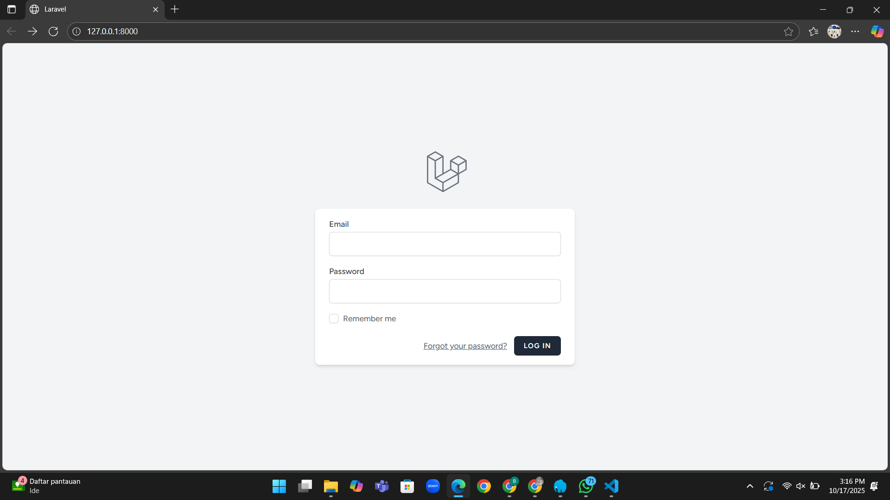

# Praktikum 4 : Autentikasi LaraPress

## Langkah-Langkah
1. Pastikan berada di folder yang sesuai
```cd LaraPress```
2. Jalankan perintah 'composer require laravel/breeze --dev'
```composer require laravel/breeze --dev```
3. Jalankan perintah untuk menginstall breeze
```php artisan breeze:install```
- Ketik 'blade' untuk Blade with Alpine
- Ketik 'No' untuk Dark Mode Support
- Ketik '0' untuk Pest
4. Install dependencies frontend menggunakan perintah 'npm install' lalu 'npm run dev'
```npm install```
```npm run dev```
5. Jalankan perintah 'php artisan migrate' untuk menambahkan kolom remember_token ke tabel users dan membuat tabel password_reset_tokens
```php artisan migrate```
6. Tampilan Page Login ketika sudah berhasil


