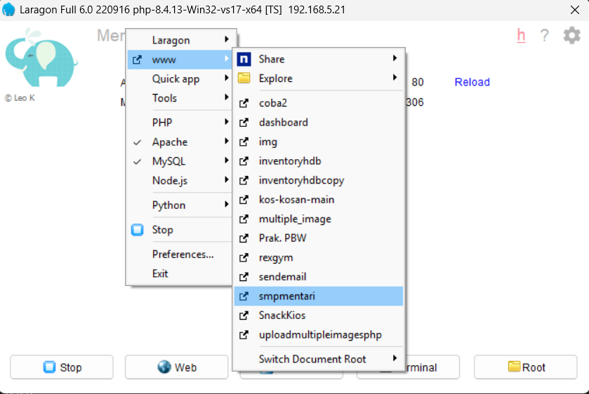
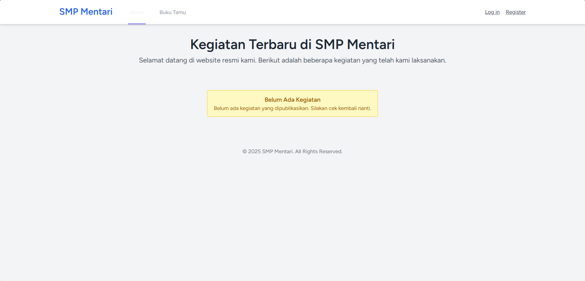
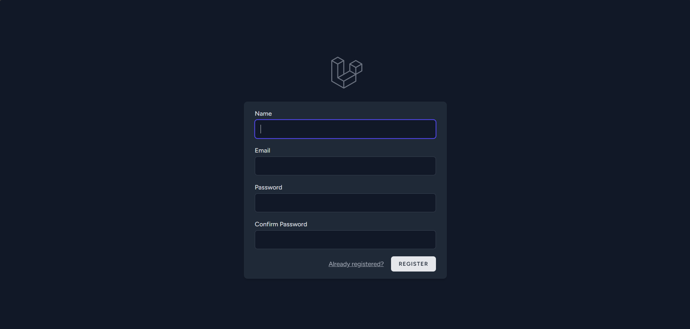
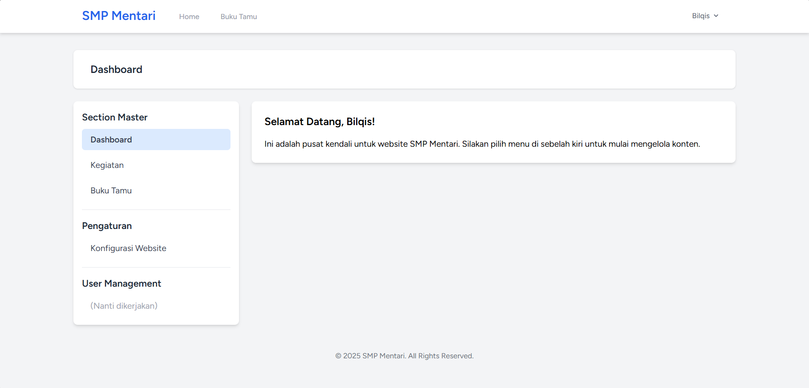
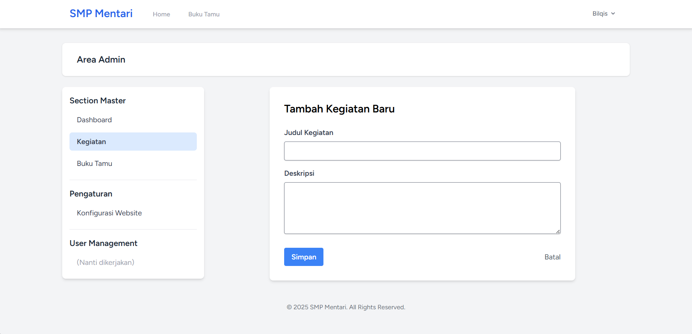
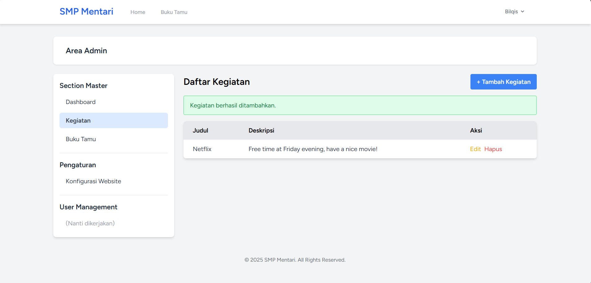

# Praktikum 5 : Web SMP Mentari

## Langkah - Langkah
1. Git clone folder SMPMentari dari Github 
```bash
   git clone https://github.com/adiwp/smpmentari.git
```
2. Masuk ke foldernya 
```bash 
   cd laragon/www/smpmentari
```
3. Install Dependencies
```bash
   # Install PHP Dependencies
   composer install

   # Install Node Dependencies
   npm install
```
4. Setup Environment
```bash
   # Copy file .env
   cp .env.example .env
   
   # Generate Application Key
   php artisan key:generate
```
5. Setup Database 
```bash
   # Jalankan Migrasi
   php artisan migrate
```
6. Build Asset
```bash
   # Development
   npm run dev

   # Production
   npm run build
```
7. Jalankan Aplikasi
```bash 
   # Menggunakan Built-in Server
   php artisan serve
```
atau Jalankan melalui laragon 


## View
1. Tampilan Awal

2. Page Register 

3. Page Dashboard

4. Page Kegiatan -> Tambah Kegiatan

5. Kegiatan Berhasil di Tambahkan

