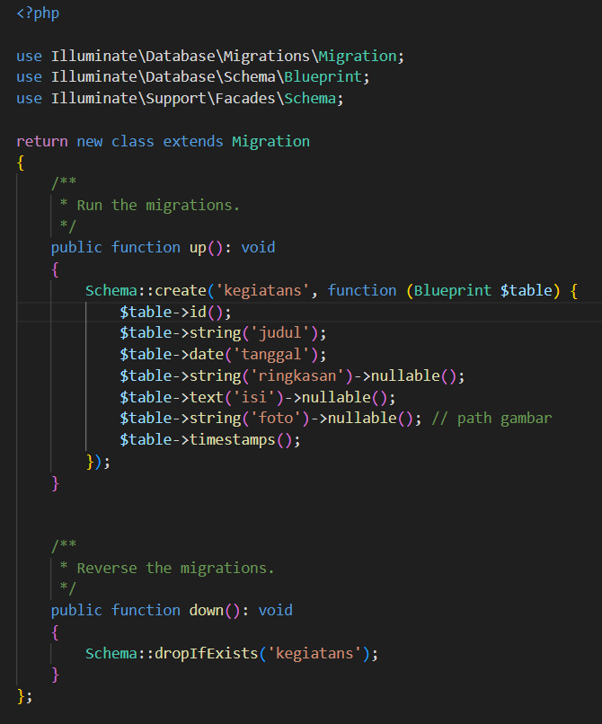
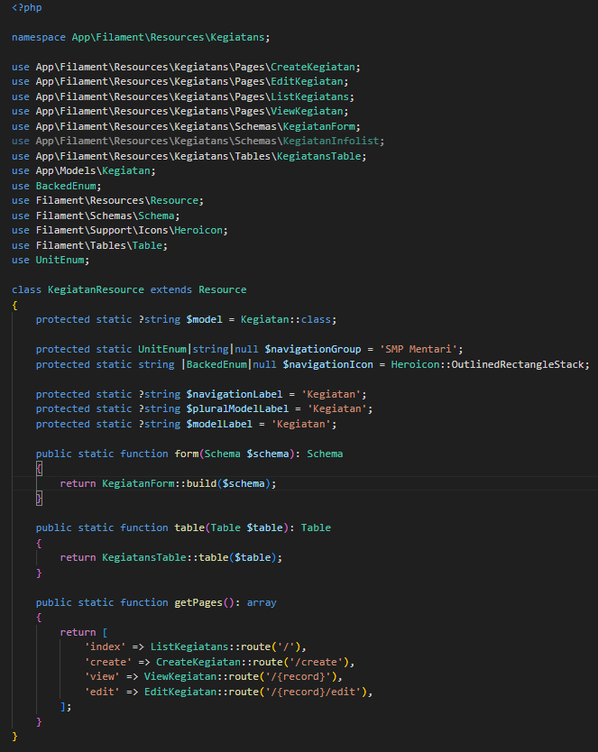
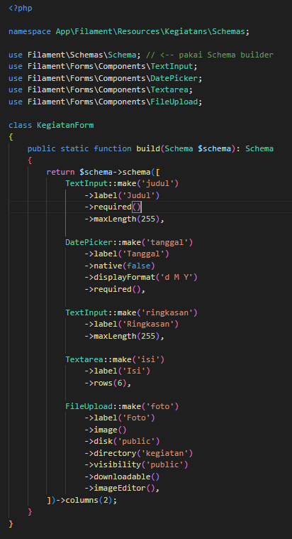
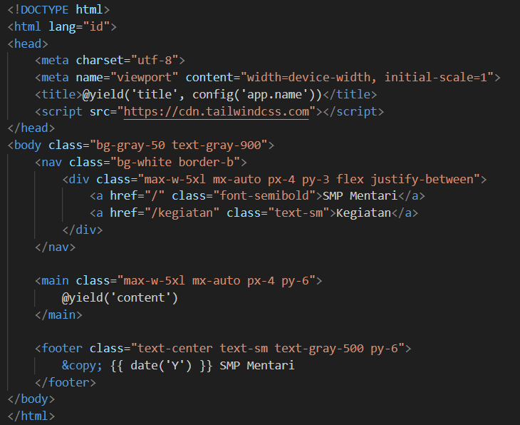
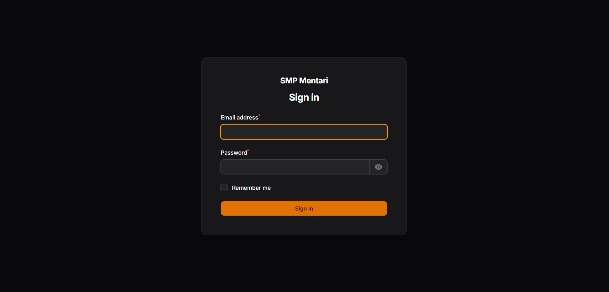
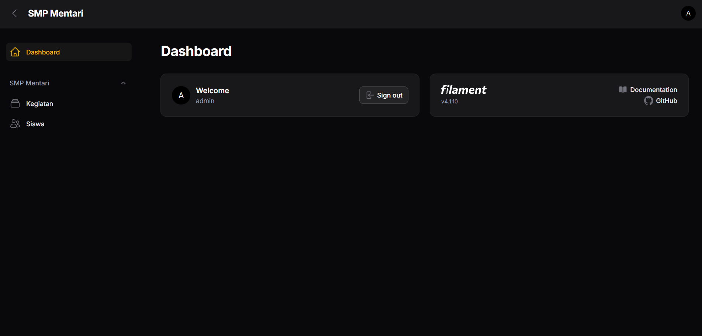
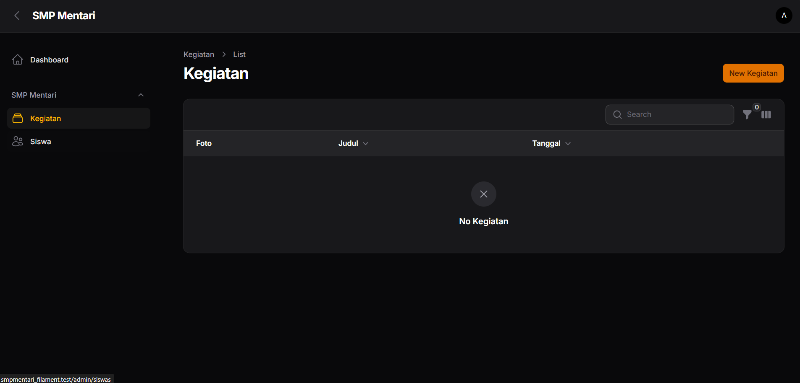

# Praktikum 6 : Web SMP Mentari Filament

## Langkah - Langkah

1. Buat empty project

```bash
   composer create-project laravel/laravel smpmentari_filament

   # Masuk ke folder nya
   cd smpmentari_filament
```

2. Coba jalankan server

```bash
   php artisan serve
```

3. Konfigurasi pada .env

```bash
    DB_CONNECTION=sqlite
    DB_HOST=127.0.0.1
    DB_PORT=3306
    DB_DATABASE=smpmentari_filament
    DB_USERNAME=root
    DB_PASSWORD=
```

4. Migrasi (Membuat database sesuai dengan file yang terdapat pada folder database/migrations)

```bash
   php artisan migrate
```

5. Install filament

```bash
   composer require "filament/filament"

    > Kalau error : di php.ini bagian ;extension=zip di aktifin -> extension.zip (tanpa ;)
```

6. Generate Panel Admin

```bash
   php artisan filament:install --panels

   # What is the panel’s ID?(admin)
```

7. Buat Akun filament

```bash
    php artisan make:filament-user

    # Ikuti prompt: name (admin), email(admin@example.com), password(admin123)
```

8. Link storage untuk upload file
```bash
    php artisan storage:link
```

9. Jalankan menggunakan

```bash
    php artisan serve

    # Akses :  http://localhost:8000/admin
```

10. Buat Model & Migrasi

```bash
    php artisan make:model Kegiatan -m
    php artisan make:model Siswa -m
```

11. Edit Migrasi  
    <span style="color:gray">Edit pada database/migrations/ xxxx_xx_xx_xxxxxx_create_kegiatans_table.php</span>
    <br> 
    

    <span style="color:gray">Edit pada database/migrations/xxxx_xx_xx_xxxxxx_create_siswa_table.php</span>
    <br> 
    


Jalankan Migrasi   
```bash
    php artisan migrate 
```
<br>

12. Generate Filament Resource (CRUD Otomatis)
```bash
    php artisan make:filament-resource Kegiatan --generate  
    php artisan make:filament-resource Siswa --generate
```
- Perintah ini akan membuat beberapa file, yaitu :  
    1. app/Filament/Resources/KegiatanResource.php 
    2. app/Filament/Resources/KegiatanResource/Pages/{Create,Edit,List}Kegiatans.php 
    3. app/Filament/Resources/SiswaResource.php 
    4. app/Filament/Resources/SiswaResource/Pages/{Create,Edit,List}Siswas.php

13. Form & Tabel Kegiatan
    <span style="color:gray">Edit app/filament/Resource/Kegiatans/KegiatanResource.php</span>
    <br> 
    

    <br>

    <span style="color:gray">Edit app/filament/Resource/Kegiatans/Schemas/KegiatansForm.php</span>
    <br> 
    

    <br> 

    <span style="color:gray">Edit app/filament/Resource/Kegiatans/Tables/KegiatansTable.php</span>
    <br> 
    

14. Form & Tabel Siswa 
    <span style="color:gray">Edit app/filament/Resource/Siswas/SiswaResource.php</span>
    <br> 
    

    <br>

    <span style="color:gray">Edit app/filament/Resource/Siswas/Schemas/SiswaForm.php</span>
    <br> 
    

    <br> 

    <span style="color:gray">Edit app/filament/Resource/Siswa/Tables/SiswaTable.php</span>
    <br> 
    

    <br> 

    <span style="color:gray">Edit app/Models/Kegiatan.php</span>
    <br> 
    

    <br> 

    <span style="color:gray">Edit app/Models/Siswa.php</span>
    <br> 
    

15. Branding Panel : Identitas SMP Mentari  
Buka app/Providers/Filament/AdminPanelProvider.php dan tambahkan :
```bash
    ->brandName('SMP Mentari')
    ->navigationGroups([
        'Akademik', 'Publikasi'])
    ->sidebarCollapsibleOnDesktop(true). 
```

16. Buat Halaman Depan (Public)
Pada routes/web.php
```bash
    Route::get('/', function () {
        return view('welcome');
    });

    Route::get('/kegiatan', function () {
        return view('kegiatan-public', [
            'items' => \App\Models\Kegiatan::latest()->paginate(9),
        ]);
    });
```

Lalu pada resources/views/kegiatan-public.blade.php  


<br>

dan resources/views/layouts/app.blade.php  


> Pastikan sudah menjalankan 
```bash
    php artisan storage:link 
```
> agar gambar dari FileUpload tampil di halaman publik. 

<br>

## View
1. Login  
<br>



2. Admin
<br>




3. Kegiatan
<br>

